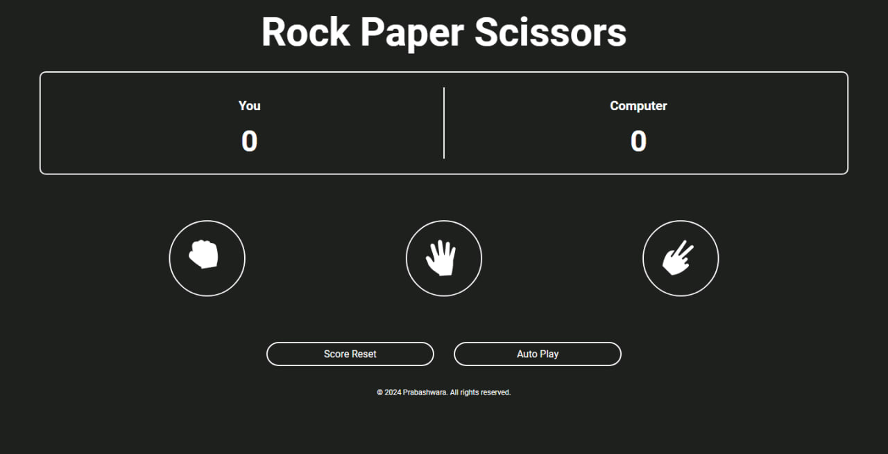

# Rock, Paper, Scissors Game 🎮
## Overview

  Welcome to the Rock, Paper, Scissors game! This is a simple web-based game built using JavaScript. Players can play against the computer, and the game follows the classic rules:

<ul>
  <li>Rock beats Scissors</li>
  <li>Scissors beats Paper</li>
  <li>Paper beats Rock</li>
</ul>

## Web Preview

You can play the game directly from your browser by visiting the link below:

<a href="https://prbshx74.github.io/Rock-Paper-Scissors/" target="_blank">Play Rock, Paper, Scissors!</a>🎉
  

Enjoy the game and try to beat the computer!

## Installation

Follow these steps to clone the repository and set up the project on your local machine:

<ol>
  <li>Clone the repository:</li>
  
    git clone https://github.com/prbshx74/Rock-Paper-Scissors.git
  
  <li>Navigate to the project directory:</li>
  
    cd Rock-Paper-Scissors
  
  <li>Open the index.html file in your browser:</li>
  
  
You can do this by simply double-clicking the index.html file or opening it in any modern web browser like Chrome, Firefox, or Edge.

</ol>

## Usage

Once you’ve opened the index.html file in your browser, you can start playing immediately!

<ul>
  <li>Select your move (Rock, Paper, or Scissors) by clicking on the buttons.</li>
  <li>The computer will automatically make its choice.</li>
  <li>The result (win, lose, or tie) will be displayed after each round.</li>
</ul>

## Rules

The game follows the basic rules of Rock, Paper, Scissors:

<ul>
  <li>Rock beats Scissors</li>
  <li>Scissors beats Paper</li>
  <li>Paper beats Rock</li>
</ul>

Contributing

Contributions are welcome! If you'd like to improve the game or add features, feel free to fork the repository, create a new branch, and submit a pull request.

<ol>
  <li>Fork the repository.</li>
  <li>Create a new branch:</li>
  
    git checkout -b feature-branch

  <li>Commit your changes:</li>

    git commit -m 'Add some feature'
    
  <li>Push to the branch:</li>
  
    git push origin feature-branch
    
  <li>Open a pull request.</li>
</ol>
